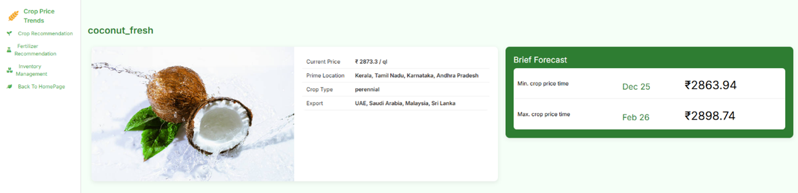
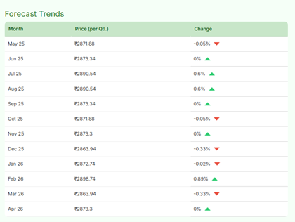

# Smart-Farming-Solution

This project uses:
- **Python** → for Machine Learning models  
- **Node.js** → for backend APIs  
- **Flutter** → for mobile app frontend  
- **MongoDB Atlas** → for database

# For detailed information refer project report in the root directory of repository.

# Prerequisites
1) Python 3.8+.
2) Node.js (v16 or higher) and npm.
3) MongoDB should be running on Atlas (cloud-hosted).
4) Flutter SDK


##  Python Setup

1. Create a virtual environment:
   ```bash
   python -m venv venv
   venv\Scripts\activate
   ```
2. Install required Python packages:

   pip install -r requirements.txt

## Node.js Setup

npm init -y
npm install express cors body-parser axios mongodb

## Flutter Setup

cd smart-farm
flutter pub get
flutter run


## 🔧 Environment Variables

This project uses **MongoDB Atlas** for database connection.  
You need to create a `.env` file in the project root with the following variables:

```env
MONGO_URI=your_mongodb_atlas_connection_string
PORT=3000
```
# Running the Project

1. Run the Flask backend
   
    cd backend/ml_models   
    python ml_api.py
   
3. Run the Node.js Server
   
    cd backend   
    node server.js
   
5. For Flutter frontend
   
    cd smart_farm   
    flutter run

# Output Interface Screenshots






